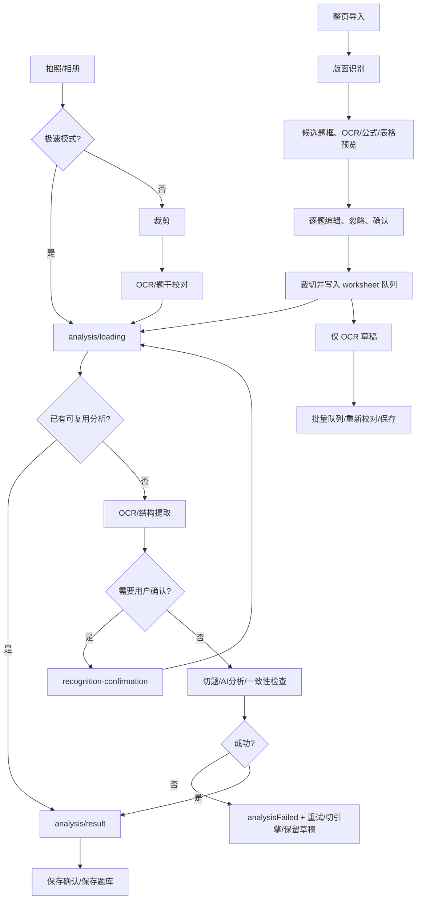

# Phase 5：错题录入流审计与后续实施拆分

日期：2026-08-11
范围：拍照/相册单题入口、整页版面识别、OCR 校对、AI 分析、批量队列、保存与恢复。

## 1. 审计结论

当前系统已经具备可用的两条主路径：

- 单题：`/add` → 拍照/相册 → 极速模式直接进入 `/analysis/loading`，或详细模式进入裁剪/校对，再进入分析。
- 整页：`/worksheet/import` → 页面裁剪 → `/worksheet/regions` 逐题确认 → 生成题图和队列 → 普通 AI 分析或仅保存 OCR 草稿。

识别确认、低置信度拦截、失败重试、批量队列、内存草稿和重复保存的基础能力已存在；本轮不需要数据库 schema 变更。当前最重要的不是再做 UI 重写，而是修正“成功结果是否已经可靠落库”和“异常/重启后是否会丢失当前工作”这两个数据流边界。

## 2. 现状流程图

## 3. 问题清单与分级

### P0：成功分析在离开分析页前没有统一保证持久化

证据：`lib/src/features/analysis/presentation/analysis_loading_screen.dart:513-555` 成功后只更新 `captureSessionProvider` 的当前题目、替换 worksheet 队列并导航；该段没有调用 `questionRepository.saveDraft(updated)`。普通单题随后依赖保存确认页，批量路径依赖工作台的批量保存；因此“分析完成”与“题库已有完整结果”不是同一时刻。进程在成功结果写入 provider 后、用户点保存前退出，会丢失分析结果。

影响：用户看到了成功结果，但重启后题库可能只有旧草稿或没有该记录；批量队列与题库的状态也可能分叉。

建议：新增独立的“分析结果提交”应用服务，先按稳定 ID upsert 完整 `QuestionRecord`，成功后再导航/推进队列；保存失败停留当前页并提供重试。不要改 schema。

### P0：同图复用路径没有把复用结果保存到当前 ID

证据：`analysis_loading_screen.dart:671-697` `_findReusableLocalAnalysis` 返回 `current.copyWith(...)`，调用方在 `:234-245` 直接更新 provider 并导航，没有保存当前题目的新 ID。

影响：重复拍摄/重复进入时虽然避免了 AI 重调用，但新记录可能没有分析结果落库，形成“界面显示已分析、重启后消失”。

建议：复用结果必须走与正常成功相同的持久化提交函数，并保留当前题目的文字/学科/图片，不直接覆盖用户修订内容。

### P1：单题分析的处理中快照不是入口处立即持久化

证据：`analysis_loading_screen.dart:267-295` OCR/结构提取完成后只更新内存 current；异常或超时分支才尝试 `saveDraft`。单题 provider 是导航上下文，不应被当作重启恢复机制。

影响：在 OCR/AI 请求期间被系统杀进程，单题原图和用户已完成的输入可能无法恢复。整页 worksheet 有 `WorksheetImportRepository` 的启动归一化，但单题没有等价的 durable job/session。

建议：进入分析前先写 `processing`/`analyzing` 草稿；每次 OCR 校正后写最新 working snapshot；启动时把无结果的 `processing`/`analyzing` 记录转为可重试失败。单题恢复可先复用已有 `AnalysisRecoveryService`，不引入新表。

### P1：非 AI 异常没有统一恢复边界

证据：`_runAnalysis` 主要捕获 `AiAnalysisException`；`File`、解析、repository 或其他未包装异常可能直接退出 Future。总超时只处理 timer 命中的情况。

影响：用户可能留在加载态或只得到框架异常，没有“重试/保留草稿/放弃清理”入口。

建议：在最外层增加窄的 `catch (error, stackTrace)`，先按当前 `working` 快照持久化为可重试失败，再展示统一恢复页；不要把未知异常伪装成 OCR 失败。

### P1：整页候选草稿的容错边界不足

证据：`WorksheetReviewDraftRepository._decode`（`lib/src/data/repositories/worksheet_review_draft_repository.dart:45-60`）直接按 enum index 和 Rect 数组读取；单个损坏字段会清除整页草稿。`copyWith` 对 nullable 字段使用 `??`，无法通过 `copyWith` 清空部分已识别字段。

影响：版本变更、手工损坏或异常写入时整页校对进度丢失；用户无法明确清空某些 OCR 字段。

建议：下一批只做安全解码（长度/范围/enum 校验，坏题目跳过并提示），以及显式 nullable setter；仍不改 schema。

### P2：识别准确性指标还没有形成可持续的验收数据

现状：已有 `confidence`、结构风险、字段确认和 provider label，但没有按样例集统计题框 IoU、OCR 字符准确率、公式/表格字段准确率、用户修改率、重复 AI 调用率和保存成功率。

建议：建立脱敏 fixture manifest 和来源字段，按快速模式/详细模式、PaddleOCR/MinerU/普通 AI 分开统计。不要把模型 confidence 当作真实准确率。

## 4. 目标流程

1. 入口生成稳定 `captureId` 和本地草稿，原图先落盘；单题和整页都将当前工作写入 durable repository。
2. 每个异步阶段携带 generation token；旧请求不能提交 provider 或 repository。
3. OCR/版面识别只负责提取证据：题框、文字、公式、表格、置信度、服务、耗时和警告。
4. 低置信度、空题干、公式不完整、题框贴边/重叠时进入字段级确认；忽略题不裁切、不入题库。
5. 用户确认后的文本作为 AI 的唯一文字输入；AI 失败时保存最新校对快照为 `analysisFailed`，提供重试/切换引擎/手动录入。
6. AI 成功后先 `saveDraft`，验证读取到同 ID 的完整结果，再导航到结果页或推进批量队列。
7. 批量保存使用事务；只有题库写成功后才从 worksheet 队列移除。队列恢复时将中断任务转为明确可重试状态。
8. 放弃操作删除题目草稿，并在无其他引用时清理临时题图；清理失败必须提示而不是静默声称完成。

## 5. 准确性与可靠性指标

| 指标 | 定义 | 最低验收方式 |
|---|---|---|
| 题框 IoU | 预测框与人工标注框交并比 | 样例集逐题记录，目标 ≥ 0.85；低于阈值必须人工确认 |
| OCR 字符准确率 | 脱敏标注文本的字符级准确率 | 印刷体 ≥ 98%，手写单列统计，不与印刷体混合 |
| 公式完整率 | 公式边界、成对标记、关键符号均保留 | 任一缺失进入确认，不自动通过 |
| 表格结构准确率 | 行列及单元格文本/Markdown 可复核 | 结构异常只提示，不静默转普通文本 |
| 用户修改率 | 确认前文本发生修改的题目比例 | 作为模型/入口质量趋势，不冒充准确率 |
| 重复 AI 调用率 | 同一稳定 ID、同一文本版本的远程调用次数 | 重复点击和重进页面均 ≤ 1 次有效调用 |
| 保存完整率 | 分析成功后重读记录，analysis/status/exercises 一致 | 100% 测试通过后才能导航 |
| 恢复率 | 模拟杀进程后可找回的草稿比例 | processing/analyzing 均变为可重试状态 |

必须覆盖的 fixture：模糊、倾斜、手写、公式、表格、多题、空白/错误图片、OCR 不完整、AI 失败、重复保存。

## 6. 不需要 schema 变更的判断

当前 Drift `QuestionRecords` 已有状态、原文、校正文、AI JSON、图片、置信度、父子题和标签；worksheet 与识别草稿已有 SharedPreferences 持久化。P0/P1 修复可以通过：

- stable ID upsert；
- `aiAnalysisJson` 继续保存 split/candidate/error 元数据；
- 现有 `ContentStatus`；
- `AnalysisRecoveryService`；
- 新增纯 domain/application service 和测试。

只有在后续指标证明需要按阶段查询/统计、跨进程锁或大批量任务恢复时，才单独提出 schema 评估卡，不在本审计直接迁移。

## 7. 后续实施批次

1. **结果提交与复用落库**：统一成功提交服务；覆盖正常成功、复用结果、批量推进、保存失败阻断导航。
2. **单题 durable recovery**：入口/阶段快照写入现有 repository；启动恢复 processing/analyzing；覆盖杀进程、OCR 中断、AI 中断。
3. **异常恢复与重试编排**：捕获非 AI 异常、失败分类、重试次数和旧 token；覆盖重复点击、超时后旧结果拒绝提交。
4. **识别草稿容错与可清空编辑**：安全 decode、坏题跳过、显式清空字段；保持旧草稿兼容。
5. **准确性 fixture 与人工流程验证**：建立脱敏样例清单、指标脚本和 Flutter widget/integration 覆盖；分别核验 PaddleOCR、MinerU 和普通 AI。
6. **schema 评估（条件任务）**：仅在前五批验证后，根据真实查询/恢复瓶颈决定是否建迁移；不提前实施。

## 8. 本轮验证记录

已完成源码审计和调用链核对；未在本机运行 Flutter/Dart（按项目约束）。本文件中的结论均对应当前仓库源码，不将静态检查描述为 Flutter 测试通过。后续每个实现子任务必须独立提交、推送，并以 GitHub Actions CI 与适用的 iOS unsigned 结果作为进入下一批的门禁。
